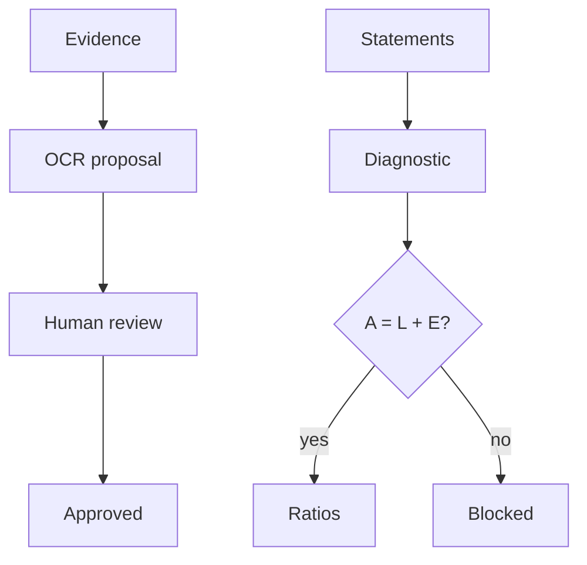

*หนึ่งโต๊ะ หลักฐานก่อนสรุป · One desk. Evidence before any conclusion. Hand-drawn studio still; no HUD on the image.*

# Ikigai Finance

[](LICENSE)
[](package.json)
[](https://github.com/Nonarkara/ikigai-finance/actions/workflows/ci.yml)

**Personal / company finance tooling — not financial advice.**

[What this is](#what-this-is) · [Philosophy](#philosophy) · [Ethical use](#ethical-use) · [How to use / learn](#how-to-use--learn) · [System diagram](#system-diagram) · [License](#license--contributing) · [Setup playbook](docs/AGENT-SETUP.md) · [Security](SECURITY.md)

A small, open-source **single-company** financial cockpit. One workspace (your company), any number of read-only reference profiles. MIT licensed. It runs fully locally with no cloud account, and optionally deploys to Cloudflare.

Author: [Non Arkaraprasertkul](https://github.com/Nonarkara) (Nonarkara), [Axiom X Co., Ltd.](https://github.com/Nonarkara). Written for a bilingual Thai–English audience. The interface in this tree is English.

---

## What this is

Ikigai Finance is a focused vertical slice — **not** a general ledger, **not** a bank, and **not** a multi-tenant product.

What is actually in this repository:

- A review-first **evidence inbox**. Send a receipt, invoice, boarding pass, itinerary, or claim document to Telegram (optional, needs a deploy). The app stores the original privately, extracts structured fields, and waits for a human to approve or reject the proposal.
- An **evidence-first diagnostic** for one company's balance sheet and income statement: formula lineage, input completeness, and a hard balance-equation check.
- An editable, lockable **single-company financial model**, with an optional two-way Google Sheets mirror.
- One **workspace** (your company) plus read-only **reference profiles** (competitor, client, partner, prospect) and a moves timeline.
- Two local modes: a fast `npm run dev` UI with clearly labeled synthetic data, and `npm run start:local` with a real offline SQLite file under `.wrangler/state`.
- Google OAuth with an `OWNER_EMAILS` allowlist, or an `APP_PASSWORD` fallback for local use. An empty allowlist fails closed.
- Tests, lint, Next.js build, CI, and a public-boundary scan that keeps secrets and private paths out of this public repo.

This is the method, on one machine. There is **no public live demo URL** in this repository.

---

## Philosophy

Studio tenets, applied to a finance desk:

**Fork the method, not the secrets.** The trust chain, the schema, and the diagnostic are public so you can learn them and run them for *your* company. Receipts, tokens, session secrets, Sheet bridges, and real figures stay on your disk (or in *your* Cloudflare account). Do not send them back as issues, screenshots, or pull requests.

**One Mac.** The core cockpit — workspace, statements, diagnostic, reference profiles — runs on a single machine. Node.js 22+ and npm are enough. No Docker, no hosted database, no cloud account for Tier 0. Cloudflare (Workers AI, D1, R2, KV) is optional and only required for Telegram OCR intake and a public deploy.

**No black-box rankings.** The app does not invent paid-in capital, assume a gross margin, cap an undefined ratio, or silently pick an Altman model. If a statement does not balance, the diagnostic **blocks the conclusion**. Altman Z′ / Z″ appears only when the caller explicitly chooses the matching private manufacturing or non-manufacturing model. Missing numbers stay missing.

**Thai–English as the audience.** This studio writes for learners and operators who move between Thai and English. The code and UI in this tree are English; currency parsing accepts `฿` among other symbols. A bilingual voice in the docs is not a claim that the product is localized.

This is **personal tooling for one company**, built the way the rest of the civic studio is built: evidence before conclusion, and a blank where the input is blank. It is not a score, not a ranking of firms, and not advice to raise, lend, or invest.

---

## Ethical use

- **Not advice.** Numbers you type or approve are yours. The diagnostic screens financial *condition*; it does not value a company or recommend a deal.
- **OCR never approves itself.** The trust chain is `original evidence → OCR proposal → human review → approved evidence`. An approved receipt is still not a reconciled bank transaction.
- **Do not commit real evidence.** `.dev.vars`, `.wrangler/`, and real company data are gitignored. Issues and PRs must use synthetic fixtures only. See [CONTRIBUTING.md](CONTRIBUTING.md) and [SECURITY.md](SECURITY.md).
- **Single-owner by design.** One company edits in place. There is no tenant switcher and no way to widen `OWNER_EMAILS` at runtime. Do not pretend otherwise.
- **Fail closed.** An empty owner allowlist admits no one. Runtime credentials belong in ignored `.dev.vars` or Cloudflare secrets — never in git.
- **Originals stay private.** Files are not public bucket URLs. They stream through a session-protected route with `private, no-store`.
- **Your jurisdiction is yours.** Tax, employment, insurance, and accounting obligations are not certified by this software.

If you need accounting-grade cash, add a bank import and a month-close workflow before treating dashboard totals as authoritative. Those steps are on the roadmap; they are not in the tree today.

---

## How to use / learn

Requirements: **Node.js 22+** and npm.

```bash
git clone https://github.com/Nonarkara/ikigai-finance.git
cd ikigai-finance
npm install
cp .dev.vars.example .dev.vars
```

Set `SESSION_SECRET` (long random) and `APP_PASSWORD` in `.dev.vars`. Leave Google / Telegram / Sheets blank for the first run.

### Fast UI (synthetic, persists nothing)

```bash
npm run dev
```

Open [http://localhost:3000](http://localhost:3000). The dashboard labels this mode **synthetic**. Use it to read the UI, not to store a real company.

### Persistent local cockpit (no cloud account)

```bash
npm run db:local        # schema → local SQLite under .wrangler/state
npm run start:local     # build + run against that file, offline
```

Sign in with `APP_PASSWORD`, edit **Workspace** and the statements. Saves survive restart. Reset with `rm -rf .wrangler/state && npm run db:local`.

The full tiered playbook — Google sign-in, Telegram intake, Sheets mirror, Cloudflare deploy — is in **[docs/AGENT-SETUP.md](docs/AGENT-SETUP.md)**. Do the tiers in order; stop when you have what you need.

### Read a diagnostic (optional)

Paste a basic statement into the dashboard, or call the evaluate route against a local server. The response separates what the balance sheet can prove from what still needs income, cash-flow, market, governance, and deal-term evidence.

```bash
curl --request POST http://localhost:3000/api/finance/evaluate \
  --header 'Content-Type: application/json' \
  --data '{
    "companyName": "Example SME",
    "currency": "USD",
    "balanceSheet": {
      "totalCurrentAssets": 250000,
      "totalAssets": 600000,
      "totalCurrentLiabilities": 100000,
      "totalLiabilities": 200000,
      "equity": 400000
    }
  }'
```

### Verify a change

```bash
npm test
npm run lint
npm run build
npm run audit:boundary
```

`audit:boundary` is the guard that keeps private paths, secrets, and real customer data out of this public repository.

---

## System diagram



Stack actually in the tree: Next.js 16 / React 19 on Cloudflare Workers via OpenNext; D1 (local SQLite) for evidence metadata, workspace, reference profiles, and the revisioned financial snapshot; R2 for private originals; KV for Telegram pairing; Workers AI for OCR and PDF-to-Markdown. Edge `middleware.js` is retained because Next 16's `proxy.js` is Node-runtime only and the current OpenNext Cloudflare adapter does not support Node middleware yet.

---

## License / contributing

MIT. Copyright © 2026 [Non Arkaraprasertkul](https://github.com/Nonarkara) / Axiom X Co., Ltd. See [LICENSE](LICENSE).

Keep changes narrow, evidence-backed, and testable. Open an issue that states the user problem and the trust impact. Never attach real receipts, credentials, or private company records. OCR output must remain a proposal — contributions that silently auto-approve financial evidence will not be accepted. Details: [CONTRIBUTING.md](CONTRIBUTING.md). Report vulnerabilities privately through GitHub's security-advisory flow ([SECURITY.md](SECURITY.md)).
